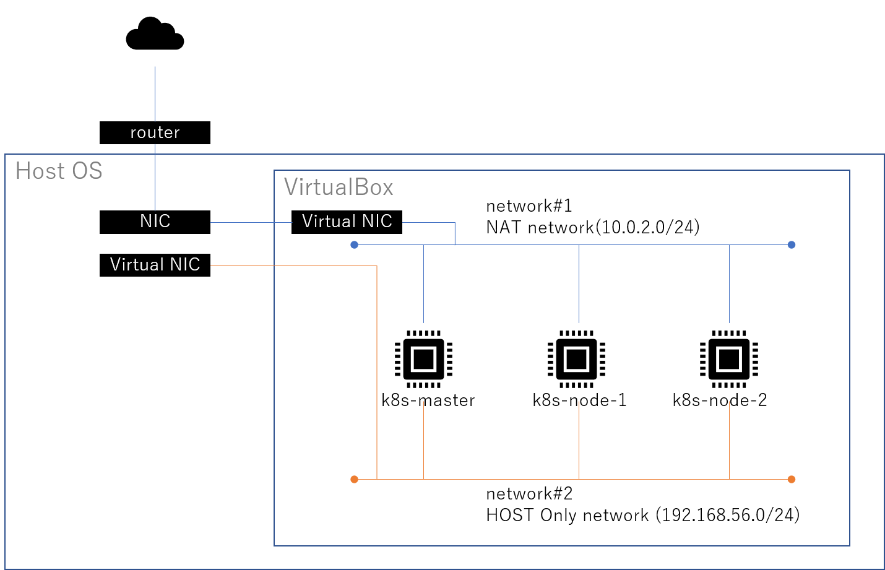

# kubeadmのインストール

Windows端末のVirtualBoxの仮想サーバ上にkubeadmをインストールすることで、ローカルkubernetes環境を作成する。
数年前にも構築したが、改めてインストールする。
参考ページ https://qiita.com/hennin/items/7ee58dd7d7c013a23be7

## 作成する環境

| Name       | OS             | network#1    | network#2         | 役割   | vCPU | memory |
| ---------- | -------------- | ------------ | ----------------- | ------ | ---- | ------ |
| k8s-master | CentOS 7         | 10.0.2.21/24 | 192.168.56.101/24 | master | 2    | 2048   |
| k8s-node-1 | CentOS 7         | 10.0.2.22/24 | 192.168.56.102/24 | node | 1    | 1024
| k8s-node-2 | CentOS 7         | 10.0.2.23/24 | 192.168.56.103/24 | node | 1    | 1024

## 構成図

## kubeadmのインストール

### kubernetesインストールのための準備

#### SELinux無効化

~~~
[root@k8s-master ~]# getenforce
Enforcing
[root@k8s-master ~]# setenforce 0
[root@k8s-master ~]# getenforce
Permissive
[root@k8s-master ~]# sed -i 's/^SELINUX=.*/SELINUX=disabled/g' /etc/selinux/config
[root@k8s-master ~]# cat /etc/selinux/config

# This file controls the state of SELinux on the system.
# SELINUX= can take one of these three values:
#     enforcing - SELinux security policy is enforced.
#     permissive - SELinux prints warnings instead of enforcing.
#     disabled - No SELinux policy is loaded.
SELINUX=disabled
# SELINUXTYPE= can take one of three values:
#     targeted - Targeted processes are protected,
#     minimum - Modification of targeted policy. Only selected processes are protected. 
#     mls - Multi Level Security protection.
SELINUXTYPE=targeted 
~~~

#### firewalld無効化

~~~
[root@k8s-master ~]#  systemctl status firewalld
● firewalld.service - firewalld - dynamic firewall daemon
   Loaded: loaded (/usr/lib/systemd/system/firewalld.service; enabled; vendor preset: enabled)
   Active: active (running) since 月 2022-03-21 02:17:43 JST; 52min ago
     Docs: man:firewalld(1)
 Main PID: 2775 (firewalld)
   CGroup: /system.slice/firewalld.service
           mq2775 /usr/bin/python -Es /usr/sbin/firewalld --nofork --nopid

 3月 21 02:17:41 k8s-master.local systemd[1]: Starting firewalld - dynamic firewall daemon...
 3月 21 02:17:43 k8s-master.local systemd[1]: Started firewalld - dynamic firewall daemon.
[root@k8s-master ~]# systemctl stop firewalld
[root@k8s-master ~]# systemctl disable firewalld
Removed symlink /etc/systemd/system/multi-user.target.wants/firewalld.service.
Removed symlink /etc/systemd/system/dbus-org.fedoraproject.FirewallD1.service.
[root@k8s-master ~]# systemctl status firewalld
● firewalld.service - firewalld - dynamic firewall daemon
   Loaded: loaded (/usr/lib/systemd/system/firewalld.service; disabled; vendor preset: enabled)
   Active: inactive (dead)
     Docs: man:firewalld(1)

 3月 21 02:17:41 k8s-master.local systemd[1]: Starting firewalld - dynamic firewall daemon...
 3月 21 02:17:43 k8s-master.local systemd[1]: Started firewalld - dynamic firewall daemon.
 3月 21 03:10:44 k8s-master.local systemd[1]: Stopping firewalld - dynamic firewall daemon...
 3月 21 03:10:44 k8s-master.local systemd[1]: Stopped firewalld - dynamic firewall daemon.
 ~~~

#### ipv6無効化

~~~
[root@k8s-master ~]# echo "net.ipv6.conf.all.disable_ipv6 = 1" >> /etc/sysctl.conf
[root@k8s-master ~]# echo "net.ipv6.conf.default.disable_ipv6 = 1" >> /etc/sysctl.conf
[root@k8s-master ~]#  sysctl -p /etc/sysctl.conf
net.ipv6.conf.all.disable_ipv6 = 1
net.ipv6.conf.default.disable_ipv6 = 1
~~~

#### dockerインストールと起動設定

~~~
[root@k8s-master ~]# yum -y install docker
読み込んだプラグイン:fastestmirror
Loading mirror speeds from cached hostfile
 * base: ftp-srv2.kddilabs.jp
 * extras: ftp-srv2.kddilabs.jp
 * updates: ftp-srv2.kddilabs.jp
base                                                                                   | 3.6 kB  00:00:00     
extras                                                                                 | 2.9 kB  00:00:00     
updates                                                                                | 2.9 kB  00:00:00     
(2/4): base/7/x86_64/primary_db          0% [                               ]  0.0 B/s |    0 B  --:--:-- ETA (2/4): base/7/x86_64/primary_db          0% [                               ]  0.0 B/s | 151 kB  --:--:-- ETA (1/4): base/7/x86_64/group_gz                                                          | 153 kB  00:00:00     
(2/4): extras/7/x86_64/primary_db                                                      | 246 kB  00:00:00     
(4/4): updates/7/x86_64/primary_db       4% [=-                             ] 1.4 MB/s | 1.0 MB  00:00:14 ETA (4/4): updates/7/x86_64/primary_db       8% [==-                            ] 1.5 MB/s | 1.8 MB  00:00:12 ETA (3/4): base/7/x86_64/primary_db          11% [===                           ] 1.5 MB/s | 2.3 MB  00:00:12 ETA (3/4): base/7/x86_64/primary_db          1

～～（省略）～～

依存性を更新しました:
  audit.x86_64 0:2.8.5-4.el7            audit-libs.x86_64 0:2.8.5-4.el7   libxml2.x86_64 0:2.9.1-6.el7_9.6  
  policycoreutils.x86_64 0:2.5-34.el7  

完了しました!
[root@k8s-master ~]# systemctl start docker
[root@k8s-master ~]# systemctl enable docker
Created symlink from /etc/systemd/system/multi-user.target.wants/docker.service to /usr/lib/systemd/system/docker.service.
[root@k8s-master ~]# systemctl status docker
● docker.service - Docker Application Container Engine
   Loaded: loaded (/usr/lib/systemd/system/docker.service; enabled; vendor preset: disabled)
   Active: active (running) since 月 2022-03-21 03:29:44 JST; 48s ago
     Docs: http://docs.docker.com
 Main PID: 13067 (dockerd-current)
   CGroup: /system.slice/docker.service
           tq13067 /usr/bin/dockerd-current --add-runtime docker-runc=/usr/libexec/docker/docker-runc-curre...
           mq13072 /usr/bin/docker-containerd-current -l unix:///var/run/docker/libcontainerd/docker-contai...

 3月 21 03:29:43 k8s-master.local dockerd-current[13067]: time="2022-03-21T03:29:43.665295241+09:00" le...em"
 3月 21 03:29:43 k8s-master.local dockerd-current[13067]: time="2022-03-21T03:29:43.871011644+09:00" le...ds"
 3月 21 03:29:43 k8s-master.local dockerd-current[13067]: time="2022-03-21T03:29:43.872115281+09:00" le...t."
 3月 21 03:29:43 k8s-master.local dockerd-current[13067]: time="2022-03-21T03:29:43.952500194+09:00" le...se"
 3月 21 03:29:44 k8s-master.local dockerd-current[13067]: time="2022-03-21T03:29:44.104590042+09:00" le...ss"
 3月 21 03:29:44 k8s-master.local dockerd-current[13067]: time="2022-03-21T03:29:44.230976776+09:00" le...e."
 3月 21 03:29:44 k8s-master.local dockerd-current[13067]: time="2022-03-21T03:29:44.267129500+09:00" le...on"
 3月 21 03:29:44 k8s-master.local dockerd-current[13067]: time="2022-03-21T03:29:44.267160745+09:00" le...3.1
 3月 21 03:29:44 k8s-master.local systemd[1]: Started Docker Application Container Engine.
 3月 21 03:29:44 k8s-master.local dockerd-current[13067]: time="2022-03-21T03:29:44.281778388+09:00" le...ck"
Hint: Some lines were ellipsized, use -l to show in full.
[root@k8s-master ~]# 
~~~

#### kubernetesのnet.bridge設定

~~~
[root@k8s-node-1 ~]# vi /etc/sysctl.d/k8s.conf
[root@k8s-node-1 ~]# cat /etc/sysctl.d/k8s.conf 
net.bridge.bridge-nf-call-ip6tables = 1
net.bridge.bridge-nf-call-iptables = 1
[root@k8s-master ~]# sysctl --system
* Applying /etc/sysctl.conf ...
net.ipv6.conf.all.disable_ipv6 = 1
net.ipv6.conf.default.disable_ipv6 = 1
[root@k8s-master ~]# 
~~~

#### Kubernetes用のリポジトリ登録とインストール

~~~
[root@k8s-node-1 ~]# vi /etc/yum.repos.d/kubernetes.repo
[root@k8s-node-1 ~]# cat /etc/yum.repos.d/kubernetes.repo 
[kubernetes]
name=Kubernetes
baseurl=https://packages.cloud.google.com/yum/repos/kubernetes-el7-x86_64
enabled=1
gpgcheck=1
repo_gpgcheck=1
gpgkey=https://packages.cloud.google.com/yum/doc/yum-key.gpg https://packages.cloud.google.com/yum/doc/rpm-package-key.gpg
exclude=kube*
[root@k8s-node-1 ~]# yum install -y kubelet kubeadm kubectl --disableexcludes=kubernetes
~~~

通常上記コマンドでインストールができるのだが、エラーが発生しインストールができない事象が発生。
解析の結果、gpgの鍵の検証が失敗することで、リポジトリがダウンロードできない状態だと判明。
”repo_gpgcheck=0”を設定し、チェックをスキップすることでエラーを解消。（セキュリティ強度が低下した状態となっている）[troubleshoot#1](#ts1)

~~~
[root@k8s-node-1 ~]# vi /etc/yum.repos.d/kubernetes.repo
[root@k8s-node-1 ~]# cat /etc/yum.repos.d/kubernetes.repo 
[kubernetes]
name=Kubernetes
baseurl=https://packages.cloud.google.com/yum/repos/kubernetes-el7-x86_64
enabled=1
gpgcheck=1
repo_gpgcheck=0 #変更点
gpgkey=https://packages.cloud.google.com/yum/doc/yum-key.gpg https://packages.cloud.google.com/yum/doc/rpm-package-key.gpg
exclude=kube*
[root@k8s-node-1 ~]# yum install -y kubelet kubeadm kubectl --disableexcludes=kubernetes
読み込んだプラグイン:fastestmirror, product-id, search-disabled-repos, subscription-manager

This system is not registered with an entitlement server. You can use subscription-manager to register.

Loading mirror speeds from cached hostfile
 * base: ftp-srv2.kddilabs.jp
 * extras: ftp-srv2.kddilabs.jp
 * updates: ftp-srv2.kddilabs.jp

～～（省略）～～

インストール:
  kubeadm.x86_64 0:1.23.5-0           kubectl.x86_64 0:1.23.5-0           kubelet.x86_64 0:1.23.5-0          

依存性関連をインストールしました:
  conntrack-tools.x86_64 0:1.4.4-7.el7                  cri-tools.x86_64 0:1.23.0-0                          
  kubernetes-cni.x86_64 0:0.8.7-0                       libnetfilter_cthelper.x86_64 0:1.0.0-11.el7          
  libnetfilter_cttimeout.x86_64 0:1.0.0-7.el7           libnetfilter_queue.x86_64 0:1.0.2-2.el7_2            
  socat.x86_64 0:1.7.3.2-2.el7                         

完了しました!
~~~

#### swapオフ
~~~
[root@k8s-master ~]# swapoff -a
[root@k8s-master ~]# vi /etc/fstab 
[root@k8s-master ~]# cat /etc/fstab

#
# /etc/fstab
# Created by anaconda on Mon Mar 21 00:50:50 2022
#
# Accessible filesystems, by reference, are maintained under '/dev/disk'
# See man pages fstab(5), findfs(8), mount(8) and/or blkid(8) for more info
#
/dev/mapper/centos-root /                       xfs     defaults        0 0
UUID=a2a5c6a6-9840-4387-9135-8d7de0c7a3ad /boot                   xfs     defaults        0 0
#/dev/mapper/centos-swap swap                    swap    defaults        0 0
~~~
一番下の行のswapの設定がコメントアウトされていること。

（後に、この変更を見逃していて設定がされていないプチトラブルが発生。fstabの変更が保存されていなかったことにより、reboot後にswapが再度有効になってしまうことに。）

#### ipv4のフォワード設定

~~~
[root@k8s-master ~]# echo 1 > /proc/sys/net/ipv4/ip_forward
[root@k8s-master ~]# echo "net.ipv4.ip_forward = 1" >> /etc/sysctl.conf
[root@k8s-master ~]# sysctl -p /etc/sysctl.conf
net.ipv6.conf.all.disable_ipv6 = 1
net.ipv6.conf.default.disable_ipv6 = 1
net.ipv4.ip_forward = 1
~~~

#### コントロールプレーンノードのkubeletによって使用されるcgroupドライバーの設定

Dockerのcgroupドライバはsystemdを使用している。

kubernetesでも同じcgroupドライバを使用しないと、kubeadm init時にエラーとなる(kubernetesのデフォルトのcgroupドライバはcgroupfs)。/etc/sysconfig/kubelet内のcgroup-driverの値を以下のように変更する必要がある。

~~~
KUBELET_EXTRA_ARGS=--cgroup-driver=systemd
~~~

kubeletをリスタートする方法:
~~~
systemctl daemon-reload
systemctl restart kubelet
~~~

>cgroups (control groups) とは、プロセスグループのリソース(CPU、メモリ、ディスクI/Oなど)の利用を制限・隔離するLinuxカーネルの機能。"process containers" という名称で Rohit Seth が2006年9月から開発を開始し[1]、2007年に cgroups と名称変更され、2008年1月に Linux カーネル 2.6.24 にマージされた[2]。それ以来、多くの機能とコントローラが追加された。<https://ja.wikipedia.org/wiki/Cgroups>

## kubernetes上の役割ごとの設定

### masterの設定

#### kubeadm initの実行

~~~
[root@k8s-master ~]# kubeadm init --apiserver-advertise-address=192.168.56.101 --pod-network-cidr=10.100.0.0/1 6
[init] Using Kubernetes version: v1.23.5
[preflight] Running pre-flight checks
[preflight] Pulling images required for setting up a Kubernetes cluster

～～（省略）～～

You should now deploy a pod network to the cluster.
Run "kubectl apply -f [podnetwork].yaml" with one of the options listed at:
  https://kubernetes.io/docs/concepts/cluster-administration/addons/

Then you can join any number of worker nodes by running the following on each as root:

kubeadm join 192.168.56.101:6443 --token ＜トークン＞ \
	--discovery-token-ca-cert-hash sha256:＜トークン＞
~~~

kubeadm joinはnodeで実行するため、控えておく。

#### kubectlのコンフィグと入力補完設定

~~~
[root@k8s-master ~]# export KUBECONFIG=/etc/kubernetes/admin.conf
[root@k8s-master ~]# source <(kubectl completion bash)
[root@k8s-master ~]# echo "export KUBECONFIG=/etc/kubernetes/admin.conf" >> ~/.bashrc
[root@k8s-master ~]# echo "source <(kubectl completion bash)" >> ~/.bashrc
~~~

### CNIツールのインストール

コンテナ間の通信のために、CNIツール（calico）をインストールする。
network#1のアドレス帯域で通信をするために、calicoで使用するIPv4のCIDRを変更する。

（calicoのデフォルト192.168.0.0/16を使用する場合は実施不要。）

#### calicoで使用するIPv4のCIDRを変更

~~~
curl https://projectcalico.docs.tigera.io/manifests/calico.yaml -O
~~~

calico.yamlを取得し、その中の「CALICO_IPV4POOL_CIDR」の変数のCIDRを変更。
~~~
[root@k8s-master ~]# vi calico.yaml

～～（省略）～～
   4222             - name: CALICO_IPV4POOL_CIDR
   4223               value: "10.100.0.0/16"
～～（省略）～～

[root@k8s-master ~]# kubectl apply -f calico.yaml
configmap/calico-config created
customresourcedefinition.apiextensions.k8s.io/bgpconfigurations.crd.projectcalico.org created
customresourcedefinition.apiextensions.k8s.io/bgppeers.crd.projectcalico.org created
customresourcedefinition.apiextensions.k8s.io/blockaffinities.crd.projectcalico.org created
customresourcedefinition.apiextensions.k8s.io/caliconodestatuses.crd.projectcalico.org created
customresourcedefinition.apiextensions.k8s.io/clusterinformations.crd.projectcalico.org created
customresourcedefinition.apiextensions.k8s.io/felixconfigurations.crd.projectcalico.org created
customresourcedefinition.apiextensions.k8s.io/globalnetworkpolicies.crd.projectcalico.org created
customresourcedefinition.apiextensions.k8s.io/globalnetworksets.crd.projectcalico.org created
customresourcedefinition.apiextensions.k8s.io/hostendpoints.crd.projectcalico.org created
customresourcedefinition.apiextensions.k8s.io/ipamblocks.crd.projectcalico.org created
customresourcedefinition.apiextensions.k8s.io/ipamconfigs.crd.projectcalico.org created
customresourcedefinition.apiextensions.k8s.io/ipamhandles.crd.projectcalico.org created
customresourcedefinition.apiextensions.k8s.io/ippools.crd.projectcalico.org created
customresourcedefinition.apiextensions.k8s.io/ipreservations.crd.projectcalico.org created
customresourcedefinition.apiextensions.k8s.io/kubecontrollersconfigurations.crd.projectcalico.org created
customresourcedefinition.apiextensions.k8s.io/networkpolicies.crd.projectcalico.org created
customresourcedefinition.apiextensions.k8s.io/networksets.crd.projectcalico.org created
clusterrole.rbac.authorization.k8s.io/calico-kube-controllers created
clusterrolebinding.rbac.authorization.k8s.io/calico-kube-controllers created
clusterrole.rbac.authorization.k8s.io/calico-node created
clusterrolebinding.rbac.authorization.k8s.io/calico-node created
daemonset.apps/calico-node created
serviceaccount/calico-node created
deployment.apps/calico-kube-controllers created
serviceaccount/calico-kube-controllers created
Warning: policy/v1beta1 PodDisruptionBudget is deprecated in v1.21+, unavailable in v1.25+; use policy/v1 PodDisruptionBudget
poddisruptionbudget.policy/calico-kube-controllers created
~~~

<https://projectcalico.docs.tigera.io/getting-started/kubernetes/self-managed-onprem/onpremises>

### Nodeの設定

[kubeadm initの実行]で取得した、Node参加コマンドを、「k8s-node-1」「k8s-node-2」に対して実行する。以下は、「k8s-node-2」での実行例。

~~~
[root@k8s-node-2 ~]# kubeadm join 192.168.56.101:6443 --token <トークン>    --discovery-token-ca-cert-hash sha256:<トークン>
[preflight] Running pre-flight checks
[preflight] Reading configuration from the cluster...
[preflight] FYI: You can look at this config file with 'kubectl -n kube-system get cm kubeadm-config -o yaml'
[kubelet-start] Writing kubelet configuration to file "/var/lib/kubelet/config.yaml"
[kubelet-start] Writing kubelet environment file with flags to file "/var/lib/kubelet/kubeadm-flags.env"
[kubelet-start] Starting the kubelet
[kubelet-start] Waiting for the kubelet to perform the TLS Bootstrap...

This node has joined the cluster:
* Certificate signing request was sent to apiserver and a response was received.
* The Kubelet was informed of the new secure connection details.

Run 'kubectl get nodes' on the control-plane to see this node join the cluster.

[root@k8s-node-2 ~]# 
~~~

## 構成確認

~~~
[root@k8s-master ~]# kubectl get nodes
NAME               STATUS   ROLES                  AGE     VERSION
k8s-master.local   Ready    control-plane,master   29m     v1.23.5
k8s-node-1.local   Ready    <none>                 3m31s   v1.23.5
k8s-node-2.local   Ready    <none>                 25m     v1.23.5
~~~

## troubleshoot

### kubeadmのインストール時にGPG keyによる検証がエラーとなる

~~~
[root@k8s-master ~]# yum install -y kubelet kubeadm kubectl --disableexcludes=kubernetes
読み込んだプラグイン:fastestmirror, product-id, search-disabled-repos, subscription-manager

This system is not registered with an entitlement server. You can use subscription-manager to register.

Loading mirror speeds from cached hostfile
 * base: ftp.tsukuba.wide.ad.jp
 * extras: ftp.tsukuba.wide.ad.jp
 * updates: ftp.tsukuba.wide.ad.jp
kubernetes/signature                                                                   |  844 B  00:00:00     
https://packages.cloud.google.com/yum/doc/yum-key.gpg から鍵を取得中です。
Importing GPG key 0x7AA99B80:
 Userid     : "Rapture Automatic Signing Key (cloud-rapture-signing-key-2022-03-07-08_01_01.pub)"
 Fingerprint: e89b faec 34d3 1829 362f 7f7b 5668 44f3 7aa9 9b80
 From       : https://packages.cloud.google.com/yum/doc/yum-key.gpg
https://packages.cloud.google.com/yum/doc/rpm-package-key.gpg から鍵を取得中です。
kubernetes/signature                                                                   | 1.4 kB  00:00:00 !!! 
https://packages.cloud.google.com/yum/repos/kubernetes-el7-x86_64/repodata/repomd.xml: [Errno -1] repomd.xml signature could not be verified for kubernetes
他のミラーを試します。

 One of the configured repositories failed (Kubernetes),
 and yum doesn't have enough cached data to continue. At this point the only
 safe thing yum can do is fail. There are a few ways to work "fix" this:

     1. Contact the upstream for the repository and get them to fix the problem.

     2. Reconfigure the baseurl/etc. for the repository, to point to a working
        upstream. This is most often useful if you are using a newer
        distribution release than is supported by the repository (and the
        packages for the previous distribution release still work).

     3. Run the command with the repository temporarily disabled
            yum --disablerepo=kubernetes ...

     4. Disable the repository permanently, so yum won't use it by default. Yum
        will then just ignore the repository until you permanently enable it
        again or use --enablerepo for temporary usage:

            yum-config-manager --disable kubernetes
        or
            subscription-manager repos --disable=kubernetes

     5. Configure the failing repository to be skipped, if it is unavailable.
        Note that yum will try to contact the repo. when it runs most commands,
        so will have to try and fail each time (and thus. yum will be be much
        slower). If it is a very temporary problem though, this is often a nice
        compromise:

            yum-config-manager --save --setopt=kubernetes.skip_if_unavailable=true

failure: repodata/repomd.xml from kubernetes: [Errno 256] No more mirrors to try.
https://packages.cloud.google.com/yum/repos/kubernetes-el7-x86_64/repodata/repomd.xml: [Errno -1] repomd.xml signature could not be verified for kubernetes
~~~

リポジトリを削除したうえで、再インストールを実行したが解消せず。
以下のStackoverflowのページを参考にgpgcheckを無効にしたら解消。

<https://github.com/kubernetes/kubernetes/issues/60134>

