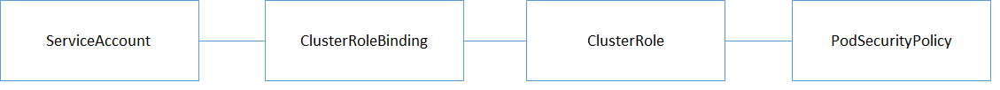

# [Kubernetes]コンテナでのセキュリティ対策

システム基盤分野におけるコンテナ技術が広がることで、クラスタレイヤでのセキュリティ対策の重要性が高まっています。
KubernetesがコントリビューションされているCloud Native Computing Foundation（CNCF）でも以下のような記事がかかれています。

>誰もが従わなければならない9つのKubernetesセキュリティのベストプラクティス
<https://www.cncf.io/blog/2019/01/14/9-kubernetes-security-best-practices-everyone-must-follow/>

初歩の初歩となるコンテナ基盤のKubernetesでのセキュリティの考え方について整理し、クラスタに対してセキュリティに関するポリシーを設定するための機能である、PodSecurityPolicyの基本的な使い方を説明します。

- [[Kubernetes]コンテナでのセキュリティ対策](#kubernetesコンテナでのセキュリティ対策)
  - [コンテナにおける4C](#コンテナにおける4c)
    - [Cloud](#cloud)
    - [Cluster](#cluster)
    - [Container](#container)
    - [Code](#code)
  - [主なセキュリティ対策](#主なセキュリティ対策)
  - [PodSecurityPolicyとは何か](#podsecuritypolicyとは何か)
  - [PodSecurityPolicyで制限するセキュリティ設定](#podsecuritypolicyで制限するセキュリティ設定)
  - [ユースケース例](#ユースケース例)
  - [PodSecurityPolicyを適用する](#podsecuritypolicyを適用する)
    - [GKE クラスタを作成する](#gke-クラスタを作成する)
    - [ServiceAccountを作成する](#serviceaccountを作成する)
      - [使用するユーザ](#使用するユーザ)
    - [PodSecurityPolicyの作成](#podsecuritypolicyの作成)
      - [sample-podsecuritypolicyの制限内容](#sample-podsecuritypolicyの制限内容)
    - [PodSecurityPolicyの適用確認](#podsecuritypolicyの適用確認)
  - [PodSecurityPolicyの動作確認](#podsecuritypolicyの動作確認)
    - [ポリシーに準拠しているPodの作成](#ポリシーに準拠しているpodの作成)
    - [ポリシーに反しているPodの作成](#ポリシーに反しているpodの作成)
  - [まとめ](#まとめ)

## コンテナにおける4C

「クラウドネイティブセキュリティの4C」と呼ばれる各レイヤで整理されることがあります。コンテナにおける4C(Cloud、Cluster、Container、Code)について簡単に記載します。なお、本記事で取り上げる、PodSecurityPolicyは**Clusterレイヤ**での対策です。

(参考)
<https://kubernetes.io/docs/concepts/security/overview/>

### Cloud

 Kuberntesを起動するクラウド基盤はクラウドプロバイダ（Google Kuberntes Engine(GKE),Azure Kuberntes Service(AKS),Elastic  Container Service for Kuberntes(EKS)等）によって提供されます。各クラウドプロバイダによりセキュリティ対策が提供されています。

### Cluster

 クラスタではPodのアクセス制御や、権限を制限したり、Pod同士が通信する際のルールを規定することが可能です。

### Container

 コンテナに対しては、コンテナイメージの脆弱性チェックやコンテナイメージに対する署名を実施する等のセキュリティ対策が可能です。

### Code

 アプリケーションコードに対しては、コンテナ、仮想マシンにかかわらずセキュアコーディングによるセキュリティ対策が可能です。

## 主なセキュリティ対策

| No. | セキュリティ対策                | 概要                                                                                                          |
| --- | ------------------------------- | ------------------------------------------------------------------------------------------------------------- |
| 1   | RBAC(Role Based Access Control) | Podに対してどのような操作を許可するかを定めたRoleを作成し、Userに対してRoleを紐づけることで権限を管理します。 |
| 2   | PodSecurityPolicy               | クラスタに対してセキュリティポリシーによる制限を行う機能です。デフォルトの設定値や制限を行うことができます。  |
| 3   | NetworkPolicy                   | クララスタ内でPod同士が通信する際のトラフィックルールを規定することができます。                               |

上記対策の内、クラスタに対してセキュリティに関するポリシーを設定するための機能である、PodSecurityPolicyの基本的な使い方を説明します。

## PodSecurityPolicyとは何か

PodSecurityPolicyとは、クラスタに対してセキュリティポリシーを設定し、Podやコンテナの挙動を制限する機能です。これにより、クラスタのデフォルトの設定値や操作の制限を行うことができます。制御可能な内容と設定する際のフィールド名を以下に示します。[https://kubernetes.io/docs/concepts/policy/pod-security-policy/]

| 制御                         | フィールド名                                                                                                                                                         |
|----------------------------|----------------------------------------------------------------------------------------------------------------------------------------------------------------|
| 特権コンテナの実行                  | privileged                                                                                                                                                     |
| ホスト名前空間の使用                 | hostPID, hostIPC                                                                                                                                               |
| ホストネットワークとポートの使用           | hostNetwork, hostPorts                                                                                                                                         |
| ボリュームタイプの使用法               | volumes                                                                                                                                                        |
| ホストファイルシステムの使用法            | allowedHostPaths                                                                                                                                               |
| 特定のFlexVolumeドライバーを許可する    | allowedFlexVolumes                                                                                                                                             |
| Podのボリュームを所有するFSGroupの割り当て | fsGroup                                                                                                                                                        |
| 読み取り専用のルートファイルシステムの使用が必要   | readOnlyRootFilesystem                                                                                                                                         |
| コンテナのユーザーIDとグループID         | runAsUser, runAsGroup, supplementalGroups                                                                                                                      |
| ルート権限へのエスカレーションの制限         | allowPrivilegeEscalation, defaultAllowPrivilegeEscalation                                                                                                      |
| Linuxのキャパシティの制限            | defaultAddCapabilities, requiredDropCapabilities, allowedCapabilities                                                                                          |
| コンテナのSELinuxコンテキスト         | seLinux                                                                                                                                                        |
| コンテナの許可されたProcマウントタイプ      | allowedProcMountTypes                                                                                                                                          |
| コンテナが使用するAppArmorプロファイル    | annotations |
| コンテナで使用されるseccompプロファイル    | annotations |
| コンテナによって使用されるsysctlプロファイル | forbiddenSysctls,allowedUnsafeSysctls                                                                                                                          |

## PodSecurityPolicyで制限するセキュリティ設定

PodSecurityPolicyで制限をすることができるセキュリティ設定は以下の設定です。Pod、コンテナの単位で設定が可能です。

| セキュリティ設定   | 単位                                        |
| ------------------ | ------------------------------------------- |
| SecurityContext    | 個々のコンテナに対するセキュリティ設定      |
| PodSecurityContext | Pod(全てのコンテナ)に対するセキュリティ設定 |

これらのセキュリティ設定には優先順位があります。以下の順序で優先されます。

1. PodSecurityPolicy
2. SecurityContext
3. PodSecurityContext

## ユースケース例

実際の開発に活用できるように、複数チームでの開発を想定したユースケースを設定し、最低限の動作確認をします。

- 複数のチームで同一のクラスタを利用する。
- Kubernetesを起動するクラウド基盤はGKEを利用する。
- ユーザの種類は「クラスタの管理者」「各チームの開発者」を設定し、それぞれ権限を設定する。

## PodSecurityPolicyを適用する

PodSecurityPolicyの動作を確認するために、Google Cloud Platform(GCP)のKubernetes Engine(GKE)にてKubernetesクラスタを作成します。

### GKE クラスタを作成する

Cloud Shell で、1つのノードを持つクラスタを **k8s-psp** という名前で作成します。このときに、明示的にPodSecurityPolicy AdmissionControllerを有効にします。
（今回作成するクラスタはPodSecurityPolicyの機能を試すだけなので、最小限のノード数1、マシンタイプn1-standard-1のクラスタを利用します。135円/日くらいで稼働します。ただし、podを複数起動するとすぐにリソース不足で起動失敗しますのでご注意ください。）

    $ CLUSTER_NAME=k8s-psp
    $ gcloud beta container clusters create $CLUSTER_NAME \
    --num-nodes=1 --enable-autoupgrade --no-enable-basic-auth \
    --no-issue-client-certificate --enable-ip-alias --metadata \
    disable-legacy-endpoints=true --enable-pod-security-policy \
    --zone asia-northeast1-a 

### ServiceAccountを作成する

PodSecurityPolicyを適用するServiceAccountを作成し動作確認を行います。

    $ kubectl create serviceaccount psp-test

作成したServiceAccountにPodの編集権限（edit）を付与します。

    $ kubectl create --save-config clusterrolebinding psp-test \
    --serviceaccount default:psp-test --clusterrole edit

#### 使用するユーザ

| ユーザ                     | クラスタ権限  | PodSecurityPolicy  |
| -------------------------- | ------------- | ------------------ |
| デフォルトユーザ           | cluster-admin | ポリシーに制限なし |
| psp-test（ServiceAccount） | edit          | 制限したポリシー   |

ユーザごとにわかりやすいようにエイリアスを設定します。

    $ alias kubectl-admin='kubectl'
    $ alias kubectl-user='kubectl --as=system:serviceaccount:default:psp-test'

### PodSecurityPolicyの作成

PodSecurityPolicyを作成し、ServiceAccountと紐づけます。
適用するPodSecurityPolicyを以下に示します。

    apiVersion: policy/v1beta1
    kind: PodSecurityPolicy
    metadata:
      name: sample-podsecuritypolicy
    spec:
      privileged: false
      allowPrivilegeEscalation: true
      allowedCapabilities:
      - '*'
      runAsUser:
        rule: 'MustRunAsNonRoot'
      allowedHostPaths:
      - pathPrefix: "/etc"
      fsGroup:
        rule: 'RunAsAny'
      supplementalGroups:
        rule: 'RunAsAny'
      seLinux:
        rule: 'RunAsAny'
      volumes:
      - '*'

#### sample-podsecuritypolicyの制限内容

+ 特権コンテナの利用を不可
+ ルートユーザでの実行を不可
+ ホストサーバの/etcディレクトリは利用可能

制限をしたPodSecurityPolicyを作成します。

    #PodSecurityPolicyの作成
    $ kubectl apply -f sample-podsecuritypolicy.yaml

    #PodSecurityPolicyをClusterroleに紐づけ
    $ kubectl create --save-config clusterrole psp-test-clusterrole \
    --verb=use \
    --resource=podsecuritypolicy \
    --resource-name=sample-podsecuritypolicy

    #ClusterRoleをServiceAccountに紐づけ
    $ kubectl create --save-config clusterrolebinding psp-test-clusterrolebinding \
    --clusterrole=psp-test-clusterrole \
    --serviceaccount=default:psp-test

ServiceAccountとClusterRoleとPodSecurityPolicyの紐づけのイメージを以下に示します。

### PodSecurityPolicyの適用確認

PodSecurityPolicyが適用できていることを確認します。

    $ kubectl-user auth can-i use podsecuritypolicy/sample-podsecuritypolicy
    Warning: resource 'podsecuritypolicies' is not namespace scoped in group 'policy'
    yes

## PodSecurityPolicyの動作確認

PodSecurityPolicyのポリシーにより、Podの作成が制限されることを確認します。

### ポリシーに準拠しているPodの作成

ポリシーに準拠する、「特権コンテナでなく」、「ルートユーザでない」Podを作成します。
PodSecurityPolicyを紐づけたServiceAccountを指定して、Podを作成します。nginxはrootユーザでの起動が必要なため、nonrootで起動可能な"tomaskral/nonroot-nginx"を使用します。

    apiVersion: v1
    kind: Pod
    metadata:
      name: sample-nonroot
    spec:
      containers:
        - name: nonroot-nginx-container
          image: tomaskral/nonroot-nginx

"sample-nonroot"Podを作成します。

    $ kubectl-user apply -f sample-nonroot.yaml
    pod/sample-nonroot created

    $ kubectl-user get pods
    NAME             READY   STATUS    RESTARTS   AGE
    sample-nonroot   1/1     Running   0          30s

ポリシーに準拠しているため、Podの作成は成功します。

### ポリシーに反しているPodの作成

ポリシーに準拠しない、「特権コンテナを指定する」、「ルートユーザでの起動が必要」Podを作成します。

    apiVersion: v1
    kind: Pod
    metadata:
      name: sample-privileged
    spec:
      containers:
        - name: nginx-container
          image: nginx:1.12
          ports:
          - containerPort: 80
          securityContext:
            privileged: true

"sample-privileged"Podを作成します。

    $ kubectl-user apply -f sample-privileged.yaml
    Error from server (Forbidden): error when creating "sample-privileged.yaml": pods "sample-privileged" is forbidden: unable to validate against any pod security policy: [spec.containers[0].securityContext.privileged: Invalid value: true: Privileged containers are not allowed]

ポリシーに反しているため、Podの作成がエラーとなります。

## まとめ

コンテナ技術を商用で利用する上で、セキュリティ対策は不可欠なものです。冒頭にも記載しましたが、CNCFでも多くのKubernetesのセキュリティに関する記事が投稿されています。日々最新の情報の入手が重要です。

Kubernetesを利用する上での、セキュリティに関するポリシーを設定するための機能である、PodSecurityPolicyの説明と基本的な使い方を説明しました。複数の案件で同一のクラスタを利用する場合、各開発者に対して適切な権限を与える必要があります。PodSecurityPolicyを利用することで「特権ユーザ」、「開発ユーザ」等それぞれに権限の設定が可能となります。
